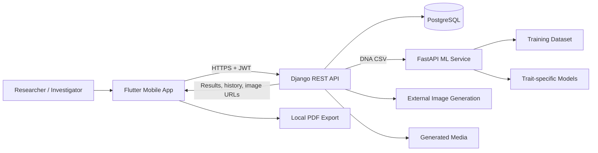
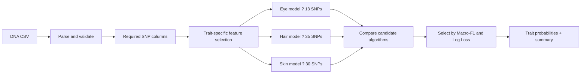

<div align="center">


# GenoScene

### Forensic DNA Phenotyping ? Graduation Project

[](https://flutter.dev/)
[](https://www.django-rest-framework.org/)
[](https://fastapi.tiangolo.com/)
[](https://www.postgresql.org/)
[](https://www.python.org/)

</div>

> [!IMPORTANT]
> GenoScene is an academic research prototype. Its predictions and generated portraits must
> not be treated as verified identity evidence or used as the sole basis for a forensic
> decision.

## Overview

GenoScene is a graduation project that explores **forensic DNA phenotyping**: predicting
visible traits from selected genetic markers (SNPs). A user uploads a supported DNA CSV
sample through the Flutter application, the backend coordinates analysis with a dedicated
machine-learning service, and the results are stored in the user's private analysis history.

The current prototype predicts probability distributions for:

- eye colour
- hair colour
- skin tone

It can also create an **illustrative AI portrait** from the highest-probability traits and
export the analysis as a PDF report.

## System Architecture



See [Architecture and Component Roles](docs/ARCHITECTURE.md) for the complete request flow and
the responsibility of each subsystem.

## Component Roles

| Component | Responsibility |
| --- | --- |
| Flutter mobile app | Authentication, DNA file selection, upload, results, history, profile, learning content, PDF export, portrait saving and sharing |
| Django REST backend | JWT authentication, user-scoped access, request validation, ML orchestration, persistence, history, soft deletion and media handling |
| FastAPI ML service | CSV parsing, required-SNP validation, feature selection, trait-model training and probability inference |
| PostgreSQL | Users, DNA samples, analyses, predictions, generated faces and model-operation logs |
| Image-generation integration | Produces an illustrative portrait from predicted eye, hair and skin traits |

## End-to-End Workflow

1. The user signs in or creates an account.
2. The Flutter app selects a `.csv` or `.txt` DNA sample.
3. The app sends the file to `POST /api/analyze/` using a JWT access token.
4. Django forwards the sample to the FastAPI ML service on port `8080`.
5. The ML service validates the required SNP columns and returns trait probabilities.
6. Django stores the DNA sample, analysis and final prediction in PostgreSQL.
7. Flutter displays the probability distributions and saves the report in the user's history.
8. The user may request an illustrative portrait or export a PDF report.

## Mobile Application

The mobile client is built with Flutter and uses Provider for shared user/report state.

Key screens include:

- onboarding and splash experience
- login, registration and guest mode
- home dashboard and educational learning hub
- DNA sample upload and validation guidance
- analysis results with confidence visualization
- analysis history with search, filtering and deletion
- optional AI portrait generation
- profile editing, privacy policy and contact support
- PDF export, image download and sharing

API endpoints are centralized in `lib/config/api_config.dart`. The server URL is supplied at
build or run time with `GENOSCENE_API_URL`.

## Backend API

The Django REST API uses JWT authentication and scopes analysis data to the authenticated
user.

| Method | Endpoint | Purpose |
| --- | --- | --- |
| `POST` | `/api/register/` | Create an account |
| `POST` | `/api/token/` | Obtain JWT tokens |
| `POST` | `/api/token/refresh/` | Refresh an access token |
| `GET/PATCH` | `/api/me/` | Read or update the current profile |
| `POST` | `/api/analyze/` | Upload and analyze a DNA sample |
| `GET` | `/api/analysis-history/` | Return the current user's analyses |
| `POST` | `/api/generate-face/` | Generate an illustrative portrait |
| `DELETE` | `/api/analysis/{id}/delete/` | Soft-delete one analysis |
| `DELETE` | `/api/analyses/clear-all/` | Soft-delete all user analyses |
| `DELETE` | `/api/account/delete/` | Deactivate an account and its data |

## AI Pipeline

The ML service is implemented with FastAPI and Python data-science libraries.



Candidate algorithms currently include:

- Logistic Regression
- LightGBM
- XGBoost
- Histogram Gradient Boosting

The service trains the trait-specific models when it starts, then exposes `/analyze` for
inference and `/health` for status checks.

## Technology Stack

| Area | Technologies |
| --- | --- |
| Mobile | Flutter, Dart, Provider, HTTP, Dio |
| Backend | Django, Django REST Framework, SimpleJWT |
| AI service | FastAPI, Pandas, NumPy, scikit-learn, XGBoost, LightGBM |
| Database | PostgreSQL |
| Reports and media | Flutter PDF/Printing packages, Django media storage |

## Repository Structure

```text
GenoScene/
??? lib/                         # Flutter application
?   ??? config/                  # API configuration
?   ??? models/                  # Mobile data models
?   ??? providers/               # Shared application state
?   ??? screens/                 # User-facing screens
?   ??? services/                # Auth, reports and PDF export
?   ??? theme/                   # Design tokens and app theme
??? assets/                      # Images, learning media and local content
??? backend/
?   ??? dna_phenotyping/
?       ??? core/                # Django models, serializers, views and routes
?       ??? dna_phenotyping/     # Django settings and project configuration
?       ??? ml/                  # FastAPI ML service and dataset
?       ??? manage.py
??? docs/                        # Architecture documentation
??? test/                        # Flutter tests
??? pubspec.yaml                 # Flutter dependencies and assets
```

## Getting Started

The system runs as three cooperating processes:

1. FastAPI ML service on port `8080`
2. Django REST API on port `8000`
3. Flutter application

Follow the complete [Run Guide](RUN.md), including PostgreSQL and environment-variable setup.

Quick Flutter launch:

```bash
flutter pub get
flutter run --dart-define=GENOSCENE_API_URL=http://127.0.0.1:8000
```

For an Android emulator, use `http://10.0.2.2:8000` instead of `127.0.0.1`.

## Privacy and Responsible Use

DNA data is highly sensitive. A real deployment should use encrypted transport, controlled
storage, strict retention policies, access auditing and documented informed consent. Do not
commit `.env` files, credentials, real DNA samples or generated private media.

The generated face is a visualization derived from predicted traits; it is not a biometric
match or a scientifically verified reconstruction of a specific individual.

## Project Status

GenoScene is an active graduation-project prototype. The repository demonstrates the complete
mobile-to-backend-to-ML workflow while leaving room for independent scientific validation,
deployment hardening and broader automated testing.

