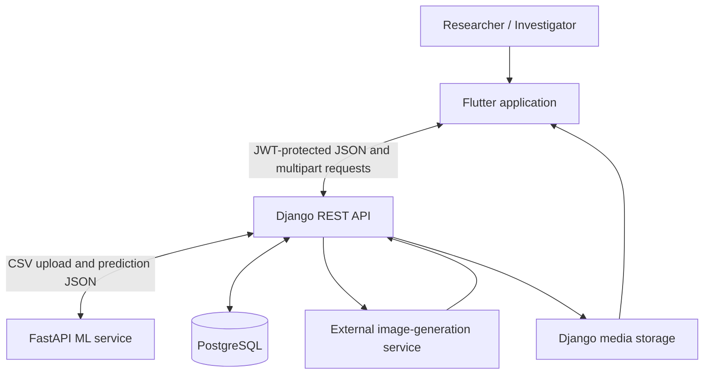
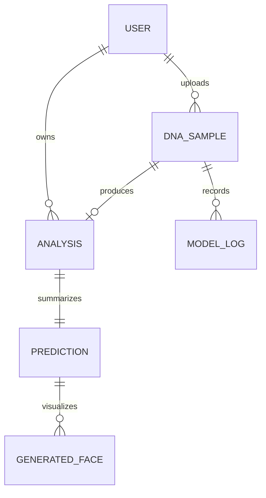
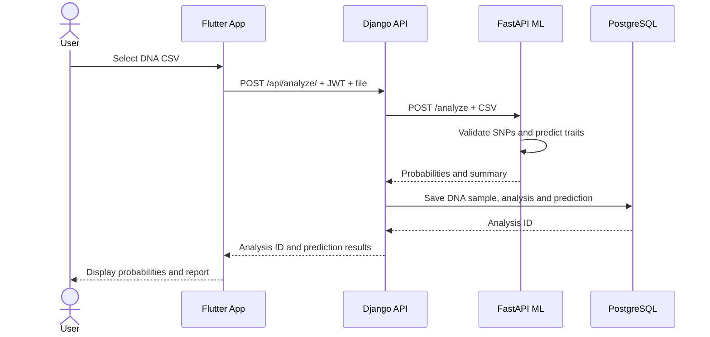

# GenoScene Architecture and Component Roles

This document explains how the mobile application, backend API, machine-learning service and
database cooperate.

## System Context



## 1. Flutter Mobile Application

The mobile layer is the user's entry point. It does not run the ML models itself.

Responsibilities:

- onboarding, authentication and guest experience
- secure API request construction with JWT access tokens
- selection and upload of DNA CSV/TXT files
- result visualization for eye, hair and skin probabilities
- analysis history and user-driven deletion
- profile, privacy, learning and contact screens
- PDF report generation on the device
- portrait display, saving and sharing

Important areas:

- `lib/config/api_config.dart` ? base URL and endpoint paths
- `lib/providers/user_provider.dart` ? profile, history and portrait state
- `lib/screens/analysis_upload_screen.dart` ? multipart upload flow
- `lib/screens/analysis_result_screen.dart` ? predictions and portrait flow
- `lib/services/auth_service.dart` ? local token persistence and profile access
- `lib/services/pdf_export_service.dart` ? local PDF report creation

## 2. Django REST Backend

Django is the system coordinator and persistence boundary.

Responsibilities:

- account registration and JWT authentication
- profile and password management
- authorization and user-level data isolation
- receiving DNA uploads from Flutter
- forwarding files to the ML service
- mapping ML output into domain records
- analysis history and soft deletion
- generated portrait orchestration and media persistence
- model-operation logging

The backend does not calculate trait probabilities directly during the main request. It calls
the FastAPI service at `http://127.0.0.1:8080/analyze`.

## 3. FastAPI Machine-Learning Service

The ML service owns model training and inference.

At startup it:

1. loads the merged dataset
2. detects SNP feature columns
3. selects high-impact SNPs independently for each trait
4. trains Logistic Regression, LightGBM, XGBoost and Histogram Gradient Boosting candidates
5. selects the best candidate using Macro-F1 and Log Loss
6. stores the selected models in process memory

During `/analyze` it:

1. parses the uploaded CSV
2. validates the required SNP columns
3. runs each trait-specific model
4. returns class probabilities, top classes and overall confidence

Current feature targets:

| Trait | Selected SNP count |
| --- | ---: |
| Eye colour | 13 |
| Hair colour | 35 |
| Skin tone | 30 |

## 4. Data Layer



Main records:

- `User` ? account and profile
- `DNASample` ? uploaded sample metadata and sequence representation
- `Analysis` ? eye, hair and skin probability maps
- `Prediction` ? highest-probability labels and scores
- `GeneratedFace` ? image URL, stored media and prompt
- `ModelLog` ? processing status and diagnostic context

Analyses, DNA samples and generated faces support soft deletion so user-facing deletion does
not immediately destroy database rows.

## Request Sequence



## Trust and Privacy Boundaries

- The mobile app handles authentication tokens and user-selected files.
- Django is responsible for confirming that every analysis belongs to the requesting user.
- The ML service is intended to remain behind the backend rather than being exposed publicly.
- Uploaded DNA and generated media are sensitive and should use controlled retention and
  access policies.
- External portrait generation receives derived visual traits. The generated image is
  illustrative and is not proof of identity.

## Runtime Topology

For local development:

```text
Flutter app ??> Django :8000 ??> FastAPI :8080
                         ?
                         ???????> PostgreSQL :5432
```

The Flutter base URL is supplied through `GENOSCENE_API_URL`. Django configuration is loaded
from `.env`; see `backend/dna_phenotyping/.env.example`.

